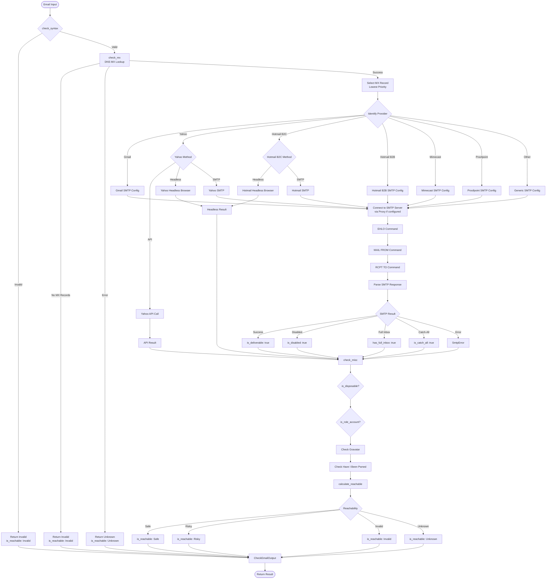
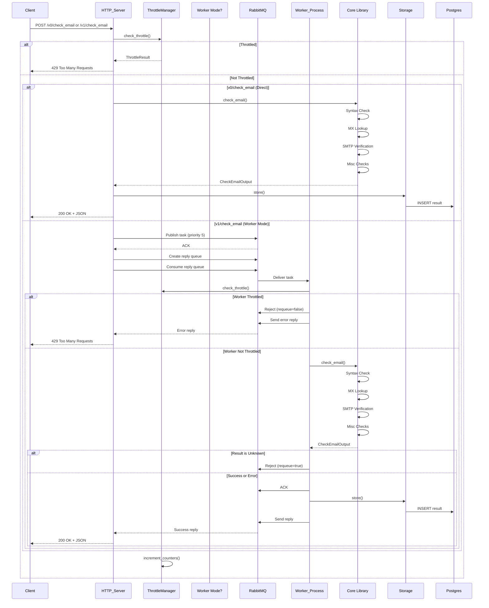
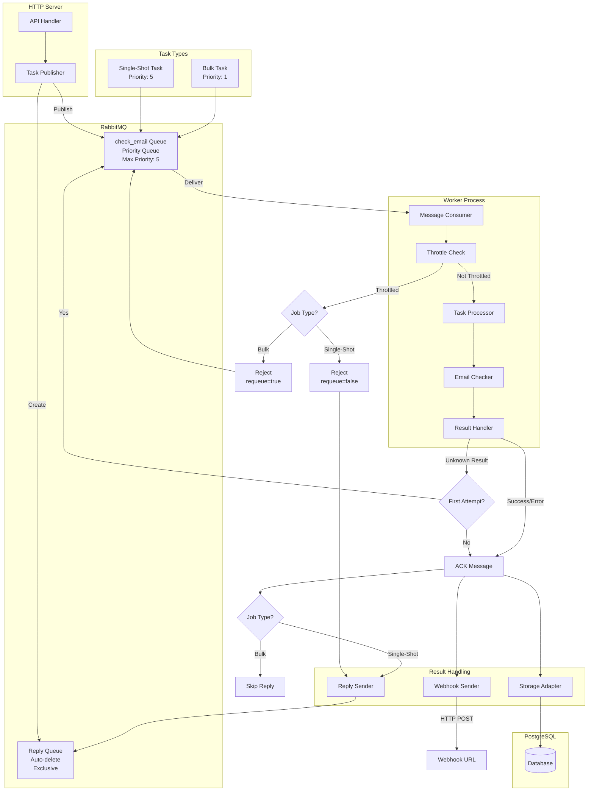
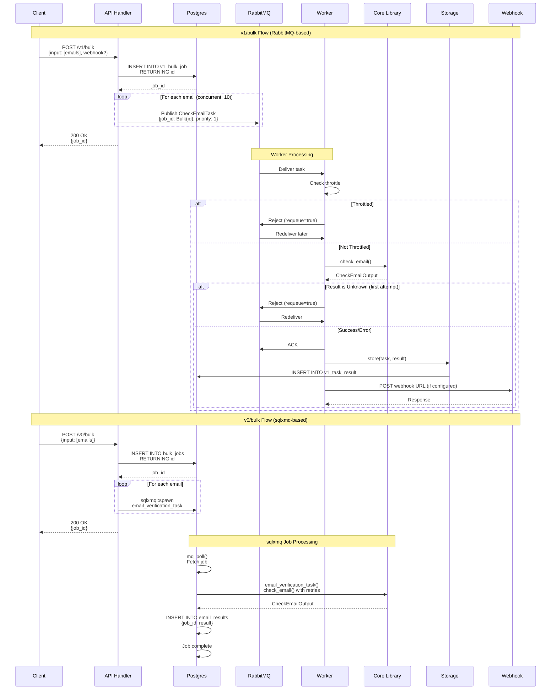
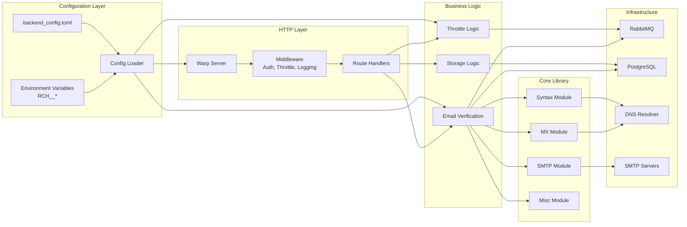

[](https://crates.io/crates/check-if-email-exists)
[](https://docs.rs/check-if-email-exists)
[](https://hub.docker.com/r/reacherhq/backend)
[](https://github.com/reacherhq/check-if-email-exists/actions)

<br /><br />

<p align="center"></p>
<h1 align="center">check-if-email-exists</h1>
<h4 align="center">Check if an email address exists without sending any email.<br/>Comes with a <a href="./backend">⚙️ HTTP backend</a>.</h4>

<br /><br /><br />

## 👉 Live Demo: https://reacher.email


This is open-source, but I also offer a **SaaS** solution that has `check-if-email-exists` packaged in a nice friendly web interface. If you are interested, find out more at [Reacher](https://reacher.email/?ref=github). If you have any questions, you can contact me at amaury@reacher.email.

<br />

## Get Started

3 non-SaaS ways to get started with `check-if-email-exists`.

### 1. ⚙️ HTTP backend using Docker (popular method 🥇) [[Full docs](./backend/README.md)]

This option allows you to run a HTTP backend using Docker 🐳, on a cloud instance or your own server. Please note that outbound port 25 must be open.

```bash
docker run -p 8080:8080 reacherhq/backend:latest
```

Then send a `POST http://localhost:8080/v0/check_email` request with the following body:

```js
{
    "to_email": "someone@gmail.com",
    "proxy": {                        // (optional) SOCK5 proxy to run the verification through, default is empty
        "host": "my-proxy.io",
        "port": 1080,
        "username": "me",             // (optional) Proxy username
        "password": "pass"            // (optional) Proxy password
    },
}
```

### 2. Download the CLI [[Full docs](./cli/README.md)]

> Note: The CLI binary doesn't connect to any backend, it checks the email directly from your computer.

Head to the [releases page](https://github.com/reacherhq/check-if-email-exists/releases) and download the binary for your platform.

```bash
> $ check_if_email_exists --help
check_if_email_exists 0.9.1
Check if an email address exists without sending an email.

USAGE:
    check_if_email_exists [FLAGS] [OPTIONS] [TO_EMAIL]
```

Check out the [dedicated README.md](./cli/README.md) for all options and flags.

### 3. Programmatic Usage [[Full docs](https://docs.rs/check-if-email-exists)]

In your own Rust project, you can add `check-if-email-exists` in your `Cargo.toml`:

```toml
[dependencies]
check-if-email-exists = "0.9"
```

And use it in your code as follows:

```rust
use check_if_email_exists::{check_email, CheckEmailInput, CheckEmailInputProxy};

async fn check() {
    // Let's say we want to test the deliverability of someone@gmail.com.
    let mut input = CheckEmailInput::new(vec!["someone@gmail.com".into()]);

    // Verify this email, using async/await syntax.
    let result = check_email(&input).await;

    // `result` is a `Vec<CheckEmailOutput>`, where the CheckEmailOutput
    // struct contains all information about our email.
    println!("{:?}", result);
}
```

The reference docs are hosted on [docs.rs](https://docs.rs/check-if-email-exists).

## ✈️ JSON Output

The output will be a JSON with the below format, the fields should be self-explanatory. For `someone@gmail.com` (note that it is disabled by Gmail), here's the exact output:

```json
{
	"input": "someone@gmail.com",
	"is_reachable": "invalid",
	"misc": {
		"is_disposable": false,
		"is_role_account": false,
		"is_b2c": true
	},
	"mx": {
		"accepts_mail": true,
		"records": [
			"alt3.gmail-smtp-in.l.google.com.",
			"gmail-smtp-in.l.google.com.",
			"alt1.gmail-smtp-in.l.google.com.",
			"alt4.gmail-smtp-in.l.google.com.",
			"alt2.gmail-smtp-in.l.google.com."
		]
	},
	"smtp": {
		"can_connect_smtp": true,
		"has_full_inbox": false,
		"is_catch_all": false,
		"is_deliverable": false,
		"is_disabled": true
	},
	"syntax": {
		"domain": "gmail.com",
		"is_valid_syntax": true,
		"username": "someone",
		"suggestion": null
	}
}
```

## What Does This Tool Check?

| Included? | Feature                                       | Description                                                                                                                     | JSON field                                                                |
| --------- | --------------------------------------------- | ------------------------------------------------------------------------------------------------------------------------------- | ------------------------------------------------------------------------- |
| ✅        | **Email reachability**                        | How confident are we in sending an email to this address? Can be one of `safe`, `risky`, `invalid` or `unknown`.                | `is_reachable`                                                            |
| ✅        | **Syntax validation**                         | Is the address syntactically valid?                                                                                             | `syntax.is_valid_syntax`                                                  |
| ✅        | **DNS records validation**                    | Does the domain of the email address have valid MX DNS records?                                                                 | `mx.accepts_mail`                                                         |
| ✅        | **Disposable email address (DEA) validation** | Is the address provided by a known [disposable email address](https://en.wikipedia.org/wiki/Disposable_email_address) provider? | `misc.is_disposable`                                                      |
| ✅        | **SMTP server validation**                    | Can the mail exchanger of the email address domain be contacted successfully?                                                   | `smtp.can_connect_smtp`                                                   |
| ✅        | **Email deliverability**                      | Is an email sent to this address deliverable?                                                                                   | `smtp.is_deliverable`                                                     |
| ✅        | **Mailbox disabled**                          | Has this email address been disabled by the email provider?                                                                     | `smtp.is_disabled`                                                        |
| ✅        | **Full inbox**                                | Is the inbox of this mailbox full?                                                                                              | `smtp.has_full_inbox`                                                     |
| ✅        | **Catch-all address**                         | Is this email address a [catch-all](https://debounce.io/blog/help/what-is-a-catch-all-or-accept-all/) address?                  | `smtp.is_catch_all`                                                       |
| ✅        | **Role account validation**                   | Is the email address a well-known role account?                                                                                 | `misc.is_role_account`                                                    |
| ✅        | **Gravatar Url**                              | The url of the [Gravatar](https://gravatar.com/) email address profile picture                                                  | `misc.gravatar_url`                                                       |
| ✅        | **Have I Been Pwned?**                        | Has this email been compromised in a [data breach](https://haveibeenpwned.com/)?                                                | `misc.haveibeenpwned`                                                     |
| 🔜        | **Free email provider check**                 | Is the email address bound to a known free email provider?                                                                      | [Issue #89](https://github.com/reacherhq/check-if-email-exists/issues/89) |
| 🔜        | **Syntax validation, provider-specific**      | According to the syntactic rules of the target mail provider, is the address syntactically valid?                               | [Issue #90](https://github.com/reacherhq/check-if-email-exists/issues/90) |
| 🔜        | **Honeypot detection**                        | Does email address under test hide a [honeypot](https://en.wikipedia.org/wiki/Spamtrap)?                                        | [Issue #91](https://github.com/reacherhq/check-if-email-exists/issues/91) |

## 🏗️ Architecture

### System Architecture Overview

```mermaid
graph TB
    subgraph "Client Layer"
        CLI[CLI Tool]
        HTTP_CLIENT[HTTP Client]
    end

    subgraph "Backend Service"
        HTTP_SERVER[Warp HTTP Server]
        CONFIG[BackendConfig]
        THROTTLE[ThrottleManager]
    end

    subgraph "API Endpoints"
        V0_CHECK[v0/check_email]
        V1_CHECK[v1/check_email]
        V0_BULK[v0/bulk]
        V1_BULK[v1/bulk]
        VERSION[/version]
    end

    subgraph "Worker System"
        RABBITMQ[RabbitMQ Queue<br/>check_email]
        WORKER[Worker Consumer]
        SINGLE_SHOT[Single-Shot Handler]
    end

    subgraph "Core Verification Library"
        SYNTAX[Syntax Check]
        MX[MX DNS Lookup]
        SMTP[SMTP Verification]
        MISC[Misc Checks]
    end

    subgraph "SMTP Providers"
        GMAIL[Gmail SMTP]
        YAHOO[Yahoo API/Headless]
        HOTMAIL[Hotmail Headless/SMTP]
        GENERIC[Generic SMTP]
    end

    subgraph "Storage Layer"
        POSTGRES[(PostgreSQL)]
        STORAGE[Storage Adapter]
        V0_RESULTS[email_results table]
        V1_RESULTS[v1_task_result table]
        BULK_JOBS[bulk_jobs table]
    end

    subgraph "External Services"
        DNS[DNS Servers]
        SMTP_SERVERS[SMTP Servers]
        WEBDRIVER[WebDriver<br/>for Headless]
        PROXY[SOCKS5 Proxy]
        WEBHOOK[Webhook URLs]
        HIBP[Have I Been Pwned API]
        GRAVATAR[Gravatar API]
    end

    CLI --> HTTP_SERVER
    HTTP_CLIENT --> HTTP_SERVER
    HTTP_SERVER --> CONFIG
    HTTP_SERVER --> THROTTLE
    HTTP_SERVER --> V0_CHECK
    HTTP_SERVER --> V1_CHECK
    HTTP_SERVER --> V0_BULK
    HTTP_SERVER --> V1_BULK
    HTTP_SERVER --> VERSION

    V0_CHECK --> SYNTAX
    V1_CHECK --> RABBITMQ
    V1_CHECK --> SYNTAX
    V0_BULK --> POSTGRES
    V1_BULK --> RABBITMQ

    RABBITMQ --> WORKER
    WORKER --> THROTTLE
    WORKER --> SYNTAX
    WORKER --> SINGLE_SHOT

    SYNTAX --> MX
    MX --> DNS
    MX --> SMTP
    SMTP --> GMAIL
    SMTP --> YAHOO
    SMTP --> HOTMAIL
    SMTP --> GENERIC
    SMTP --> PROXY
    YAHOO --> WEBDRIVER
    HOTMAIL --> WEBDRIVER

    SYNTAX --> MISC
    MISC --> HIBP
    MISC --> GRAVATAR

    WORKER --> STORAGE
    V0_CHECK --> STORAGE
    V1_CHECK --> STORAGE
    STORAGE --> POSTGRES
    POSTGRES --> V0_RESULTS
    POSTGRES --> V1_RESULTS
    POSTGRES --> BULK_JOBS

    WORKER --> WEBHOOK
    GMAIL --> SMTP_SERVERS
    GENERIC --> SMTP_SERVERS
```

### Email Verification Process Flow



### API Request Flow - Single Email Check



### Worker Queue Architecture



### Bulk Job Processing Flow



### Component Interaction Diagram



## 🤔 Why?

Many online services (https://hunter.io, https://verify-email.org, https://email-checker.net) offer this service for a paid fee. Here is an open-source alternative to those tools.

## License

`check-if-email-exists`'s source code is provided under a **dual license model**.

### Commercial license

If you want to use `check-if-email-exists` to develop commercial sites, tools, and applications, the Commercial License is the appropriate license. With this option, your source code is kept proprietary. Purchase a `check-if-email-exists` Commercial License at https://reacher.email/pricing.

### Open source license

If you are creating an open-source application under a license compatible with the GNU Affero GPL License v3, you may use `check-if-email-exists` under the terms of the [AGPL-3.0](./LICENSE.AGPL).

[➡️ Read more](https://docs.reacher.email/self-hosting/licensing) about Reacher's license.

## 🔨 Build From Source

Build the [CLI from source](./cli/README.md#build-from-source) or the [HTTP backend from source](./backend/README.md#build-from-source).

## Infrastructure & Hosting Notes

- **RabbitMQ / Worker Queue** – The managed AMQP cluster is provisioned on [CloudAMQP](https://api.cloudamqp.com/console/75fa503d-fdf0-4d60-a1b0-9250e364c8cb/nodes) and exposed via an `amqps://` URI. All worker deployments (including Helm) source the `RCH__WORKER__RABBITMQ__URL` secret to connect to this hosted control plane. For access, see the CloudAMQP console referenced above.
